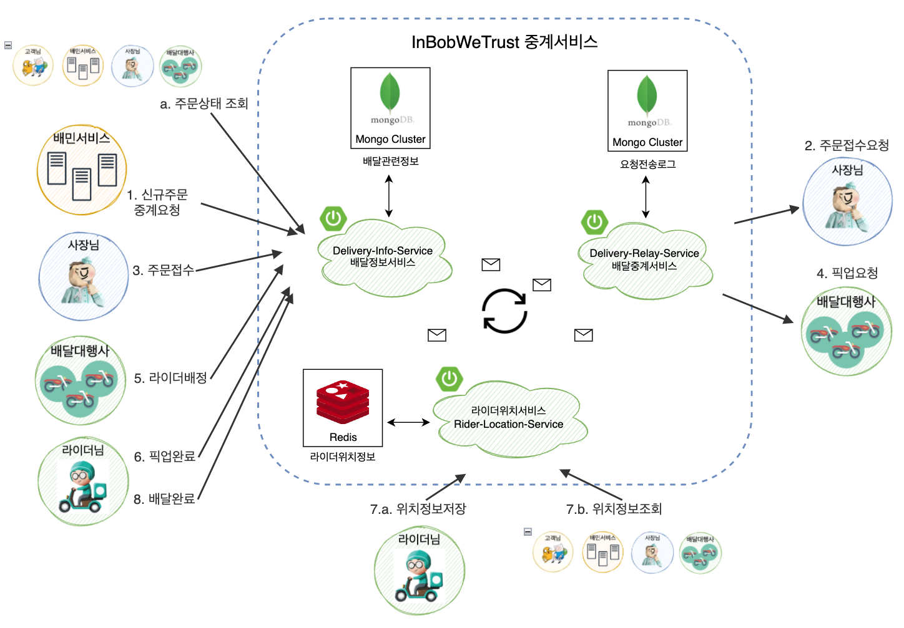

  

     

<b>"우리가 어떤 민족입니까"</b>  사장님-고객님-라이더님-배달대행사를 있는 배달의민족의 우아한 중계서비스입니다.

 

### :bicyclist: 무엇을 경험하려는 건가요?
- 단위테스트 커버리지 체크 적용 및 유지
  - :point_right: [테스트를 작성하고, 커버리지를 95% 이상 유지하며 깨달은 것들 (테스트 철학, 전략, 노하우, Jacoco)](https://vince-kim.tistory.com/36)
  - :point_right: [테스트를 작성하고, 커버리지를 95% 이상 유지하며 익힌 것들 (Reactor, Spring WebFlux, JUnit, 단위테스트, 통합테스트, 추천인강)](https://vince-kim.tistory.com/37)
- 대용량 트래픽 or 대용량 데이터를 핸들링하는 경험
  - :point_right: [서버 성능테스트 이야기 1 \[Overview\]](https://vince-kim.tistory.com/31)
  - :point_right: [서버 성능테스트 이야기 2 \[첫 테스트\]](https://vince-kim.tistory.com/32)
  - :point_right: [서버 성능테스트 이야기 3 \[성능개선 : JVM 메모리 영역 확장\]](https://vince-kim.tistory.com/33)
  - :point_right: [서버 성능테스트 이야기 4 \[성능개선 적용기 : StackTrace 최소화\]](https://vince-kim.tistory.com/34)
- 분산환경에서 여러 서비스들과 통신하는 과정을 경험하기
  - (= Microservices && interconnection)
- 트래픽 최저점시간 대비 100배까지 증가하는 점심, 저녁 피크타임 트래픽 스파이크를 어떻게 해결할까요?
  - (= Scaling && 테스트 시나리오)
- 모든 기능이 탑재된 서비스를 개발하는 것이 아닌, 진화하는 서비스를 경험하기
  - (=마일스톤)

 

### :bicyclist: 서비스는 어떻게 구성되어있나요?
- :point_right: [과거 서비스-flow Snapshot 보러가기](https://github.com/f-lab-edu/in-bob-we-trust/wiki/%EC%84%9C%EB%B9%84%EC%8A%A4%ED%94%8C%EB%A1%9C%EC%9A%B0-snapshots)
- 아래는 현재 서비스플로우 snapshot입니다. (of 2022.01.28)

  

     

 

### :triangular_ruler: 프로젝트 설명서 읽어보기

- [프로젝트 Use-Case 목록](https://github.com/f-lab-edu/in-bob-we-trust/wiki/Use-Case)
- [프로젝트 Validation 목록](https://github.com/f-lab-edu/in-bob-we-trust/wiki/Validation-%EB%AA%A9%EB%A1%9D)
- [프로젝트 Validation전략](https://github.com/f-lab-edu/in-bob-we-trust/wiki/Validation%EC%A0%84%EB%9E%B5)
- [프로젝트 커밋 메시지 컨벤션](https://github.com/f-lab-edu/in-bob-we-trust/wiki/commit-message-convention)
- [프로젝트 용어정리 dto vo entity dao](https://github.com/f-lab-edu/in-bob-we-trust/wiki/%EC%9A%A9%EC%96%B4%EC%A0%95%EB%A6%AC-dto-vo-entity-dao)

 

### :blue_book: 프로젝트 기술 블로그 읽어보기

- [프로젝트 시작하기](https://vince-kim.tistory.com/23?category=973188)
- [프로젝트 주제선정하기](https://vince-kim.tistory.com/22?category=973188)
- [배달 중계서비스를 설계하기](https://vince-kim.tistory.com/24?category=973188)
- [SwaggerUI 도큐먼트 툴 적용 + 단점 보완하기](https://vince-kim.tistory.com/25?category=973188)
- [Github 프로젝트 & Intellij 전반에 걸쳐 Google Java Style Guide 를 강제하기](https://vince-kim.tistory.com/28?category=973188)
- [\[Reactive한 라이더위치 기능구현\] 요구사항 분석부터 기능구현까지](https://vince-kim.tistory.com/29?category=973188)
- [프로젝트 비용 최적화를 위한 Reactive + MongoDB Atlas Serverless 적용 및 예시 (in Spring Webflux)](https://vince-kim.tistory.com/30)
- [서버 성능테스트 이야기 1 \[ Overview \]](https://vince-kim.tistory.com/31)
- [서버 성능테스트 이야기 2 \[ 첫 테스트 \]](https://vince-kim.tistory.com/32)
- [서버 성능테스트 이야기 3 \[ 성능개선 : JVM 메모리 영역 확장 \]](https://vince-kim.tistory.com/33)
- [서버 성능테스트 이야기 4 \[ 성능개선 적용기 : StackTrace 최소화 \]](https://vince-kim.tistory.com/34)
- [테스트를 작성하고, 커버리지를 95% 이상 유지하며 깨달은 것들 (테스트 철학, 전략, 노하우, Jacoco)](https://vince-kim.tistory.com/36)
- [테스트를 작성하고, 커버리지를 95% 이상 유지하며 익힌 것들 (Reactor, Spring WebFlux, JUnit, 단위테스트, 통합테스트, 추천인강)](https://vince-kim.tistory.com/37)
 
