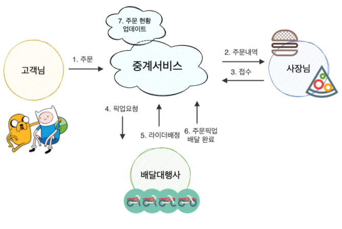

### Ver. 1

  

     

<b>"우리가 어떤 민족입니까"</b>  사장님-고객님-라이더님-배달대행사를 있는 배달의민족의 우아한 중계서비스입니다.

 

### :bicyclist: 프로젝트 목표

- [ ] 여러 각도에서 테스트를 진행하고 테스트 코드를 작성하며 버그 최소화하는 경험하기 (= 테스트 CI&CD)
    - [x] 단위테스트 instruction & branch 커버리지 100%
    - [x] 단위테스트 커버리지 체크 자동화
    - [ ] 다양한 어플리케이션 레벨 테스트 작성 (ex. Load Test, Stress Test, 여러 유저 시나리오 등...)
    - [ ] 어플리케이션 레벨 테스트 자동화 (w/ AWS)
- [ ] 예상 못한 장애들을 핸들링하는 경험하기 (= Disaster Engineering)
    - [ ] Chaos Engineering 툴 적용하기
- [ ] 모든 기능이 탑재된 서비스를 개발하는 것이 아닌, 진화하는 서비스를 경험하기 (= 프로젝트 회고)
- [ ] 분산환경에서 여러 서비스들과 통신하는 과정을 경험하기 (= Microservices && interconnection)
- [ ] 트래픽 최저점시간 대비 100배까지 증가하는 점심, 저녁 피크타임 트래픽 스파이크를 어떻게 해결할까요? (= Scaling && 테스트 시나리오)

 

### :triangular_ruler: 프로젝트 설명서 읽어보기

- [프로젝트 Use-Case 목록](https://github.com/f-lab-edu/in-bob-we-trust/wiki/Use-Case)
- [프로젝트 Validation 목록](https://github.com/f-lab-edu/in-bob-we-trust/wiki/Validation-%EB%AA%A9%EB%A1%9D)
- [프로젝트 Validation전략](https://github.com/f-lab-edu/in-bob-we-trust/wiki/Validation%EC%A0%84%EB%9E%B5)
- [프로젝트 커밋 메시지 컨벤션](https://github.com/f-lab-edu/in-bob-we-trust/wiki/commit-message-convention)
- [프로젝트 용어정리 dto vo entity dao](https://github.com/f-lab-edu/in-bob-we-trust/wiki/%EC%9A%A9%EC%96%B4%EC%A0%95%EB%A6%AC-dto-vo-entity-dao)

 

### :blue_book: 프로젝트 블로그 읽어보기

- [프로젝트 시작하기](https://vince-kim.tistory.com/23?category=973188)
- [프로젝트 주제선정하기](https://vince-kim.tistory.com/22?category=973188)
- [배달 중계서비스를 설계하기](https://vince-kim.tistory.com/24?category=973188)
- [SwaggerUI 도큐먼트 툴 적용 + 단점 보완하기](https://vince-kim.tistory.com/25?category=973188)
- [Github 프로젝트 & Intellij 전반에 걸쳐 Google Java Style Guide 를 강제하기](https://vince-kim.tistory.com/28?category=973188)
- [\[Reactive한 라이더위치 기능구현\] 요구사항 분석부터 기능구현까지](https://vince-kim.tistory.com/29?category=973188)

 

### :bicyclist: 서비스플로우 snapshot (of 2022.01.19)
- :link: [과거 Snapshot 보러가기](https://github.com/f-lab-edu/in-bob-we-trust/wiki/%EC%84%9C%EB%B9%84%EC%8A%A4%ED%94%8C%EB%A1%9C%EC%9A%B0-snapshots)

  

     

 

### :bicyclist: 로컬에서 프로젝트를 실행하려면?

1. 로컬에 `docker`를 설치합니다. :point_right: https://docs.docker.com/get-docker/
2. 필요한 포트들이 사용중인지 확인합니다.
    - `8888` delivery-info-service 서버
    - `8090` delivery-relay-service 서버
    - `27017` delivery-info-service 메인DB
    - `27018` delivery-info-service 백업DB
    - `28017` delivery-relay-service 메인DB

3. 프로젝트 루트 디렉토리에서 다음 명령을 실행해줍니다.

`docker-compose -f ./samples/docker-compose-actions.yml up -d`

 

### :bicyclist: Tips?

#### 1. 개발도중 프로젝트의 docker image를 빠르게 빌드해보고 싶다면?

- 다음 스크립트를 실행하세요. `${프로젝트root}/scripts/build-images.sh`
- (현재 Unix && Linux 에서만 가능합니다 :cry:)
- :warning: 해당 스크립트는 다음 순서로 진행됩니다.
    - 기존 이미지들을 삭제하고 (이미지 `beanskobe/delivery-info-service:latest`:
      heavy_plus_sign: `beanskobe/delivery-relay-service:latest`)
    - `gradle build`를 실행하고 (모든 테스트를 건너뒤고)
    - 이미지들을 빌드합니다.

 

### :bicyclist: Q/A

#### 1. 프로젝트의 <i class="fa fa-docker"></i> docker 이미지들은 어떻게 생성되고 어디에서 pull을 해오는 건가요?

- @JooHyukKim 의 DockerHub 저장소에서 pull 해옵니다.
- 이미지들은 프로젝트 `origin/main`의 push 이벤트에 의해 트리거되고 사전에 작성한 `build docker image 워크플로우`에서 빌드됩니다.
- 이미지 사용법 링크
    - :link: [delivery-info-service의 DockerHub 이미지 저장소 바로가기](https://hub.docker.com/repository/docker/beanskobe/delivery-info-service)
    - :link: [delivery-relay-service의 DockerHub 이미지 저장소 바로가기](https://hub.docker.com/repository/docker/beanskobe/delivery-relay-service)
